# 🚀 Mo Aramesh | AI Solution Architect & GenAI Engineer

  

> 🏆 **1st Place Winner** - Google's Agentic AI Hackathon, May 2026  
> 🤖 **Google Cloud Certified GenAI Leader**  
> 👔 **Head of AI & Automation, APAC**

---

## 👋 About Me

I'm an **AI Solution Architect, Senior AI Engineer, and Head of AI & Automation** focused on building practical GenAI systems that survive contact with real business operations.

I work across the full AI product lifecycle: strategy, solution design, cloud architecture, agentic workflows, RAG, data pipelines, LLMOps, evaluation, governance, automation, and stakeholder communication. My sweet spot is translating messy business problems into secure, scalable AI products with measurable impact.

Currently, I lead AI and automation across APAC teams, where I build AI systems for venture scouting, portfolio intelligence, investor workflows, enterprise research, outreach automation, and executive decision support.

---

## ⚡ Impact Snapshot

- 🤖 Built an autonomous AI scouting platform processing **1M+ datapoints in ~5 minutes** for **less than AUD 3**.
- 💰 Engineered AI fundraising intelligence workflows contributing to **AUD 2.1M** in successful fundraising outcomes.
- 📉 Migrated automation platforms and APIs, reducing annual subscription spend by approximately **AUD 100k**.
- 🧠 Reduced portfolio reporting cycles from roughly **3 months to 2 weeks** using secure GenAI research agents.
- 📞 Generated **160 booked calls in one week** through AI-powered scouting and outreach workflows.
- 📊 Helped reduce enterprise research project timelines from **3-5 months to 3-4 days**.
- 🌏 Delivered AI-enabled research and scouting systems across Australia, Singapore, Italy, the Netherlands, Brazil, and the UK.

---

## 🛠️ Tech Stack

  

**AI & Agents:** Gemini, Vertex AI, Google ADK, Gemini Enterprise Agent Platform, LangChain, CrewAI, Pydantic AI, OpenClaw, MCP, RAG, embeddings, vector databases, tool calling, multimodal AI, prompt engineering, fine-tuning, model evaluation.

**Cloud & MLOps:** GCP, Vertex AI, BigQuery ML, Cloud Functions, AWS, Azure AI Studio, Azure ML, Docker, Kubernetes, Terraform, CI/CD, serverless, logging, monitoring, LLMOps, MLOps.

**Engineering & Data:** Python, JavaScript, TypeScript, R, SQL, REST APIs, React, Node.js, TensorFlow, PyTorch, BigQuery, MySQL, MongoDB, Firebase, Supabase, Power BI, Tableau.

**Automation:** Make, n8n, Zapier, Apollo, Airtable, HubSpot integrations, workflow orchestration, enrichment pipelines.

---

## 🧠 What I Build

| Area | Examples |
| --- | --- |
| **Agentic AI Systems** | Deep research agents, scouting bots, portfolio intelligence agents, lead generation workflows, report-generation engines. |
| **LLMOps & Cloud AI** | Vertex AI, BigQuery ML, Google Cloud Functions, RAG pipelines, evaluation loops, logging, usage tracking, secure deployments. |
| **AI Strategy & Transformation** | AI roadmaps, governance, operating-model design, executive presentations, change management, team enablement. |
| **Automation & Data Products** | CRM integrations, enrichment pipelines, web intelligence, outreach automation, dashboards, Make/n8n/Zapier/Apollo workflows. |

---

## 🏗️ Selected Builds

### 🤖 Autonomous AI Scouting Platform

An end-to-end AI system for theme generation, deep web research, company data extraction, website checks, AI scoring, founder and decision-maker enrichment, personalised outreach, record management, and database integration.

**Stack:** Google Cloud Functions, Vertex AI, BigQuery ML, Google Model Garden, data enrichment APIs, automation pipelines.

### 📈 Investor Rating & Fundraising Intelligence

AI-powered investor discovery and evaluation workflows for fundraising teams.

**Impact:** doubled weekly lead generation capacity, reduced assessment time from weeks per 2,000 profiles to hours, and contributed to AUD 2.1M in fundraising outcomes.

### 🧾 Enterprise Research & Report Generation Agents

A multi-agent system that plans report structure, conducts parallel deep research, synthesises evidence, checks source-claim accuracy, detects bias, manages references, and produces publication-grade enterprise reports.

**Focus:** hallucination mitigation, source verification, reference management, quality checks, executive-ready outputs.

### 🔐 Portfolio Intelligence Platform

Secure GenAI workflows for portfolio reviews across public web data, alumni/company LinkedIn profiles, email records, CRM data, and historical company files.

**Impact:** reduced reporting from 3 months to 2 weeks and increased alumni compliance by 80%.

---

## 🚀 Featured Repositories

| Project | Why it matters |
| --- | --- |
| 🎯 [Prompt Gallery](https://github.com/Mo-Ara/Prompt-Gallery) | A web app for organizing, managing, and improving LLM prompts with AI-powered refinements. |
| 💼 [JobApplAI](https://github.com/Mo-Ara/JobApplAI) | Applied GenAI product engineering for job search automation and workflow UX. |
| 🏥 [MediMind-AI](https://github.com/Mo-Ara/MediMind-AI) | Domain-specific AI assistant design with healthcare workflow and Whatsapp messaging integration. |
| 🤖 [Automated-AI-Web-Researcher-Ollama](https://github.com/Mo-Ara/Automated-AI-Web-Researcher-Ollama) | Local LLM research automation, web search, report generation, and self-hosted AI workflows. |
| 📚 [gpt-researcher](https://github.com/Mo-Ara/gpt-researcher) | Autonomous research agents, source-backed synthesis, and long-form report generation. |

---

## 📊 GitHub Snapshot

  
  

---

## 🎓 Background

- 🎓 PhD in Mechanical Engineering with a data and machine learning focus, RMIT University.
- ☀️ Built ML forecasting models for distributed energy systems with **93% prediction accuracy**.
- 🔌 Analysed large-scale energy datasets supporting Solar Victoria and major Victorian energy distribution businesses.
- 🏗️ Former renewable energy and net-zero project lead across analytics, consulting, and delivery.
- 👨‍💻 10+ years programming, 7+ years in technology consulting and data engineering, 5 years in ML, and 3+ years specialising in GenAI and agentic product development.

---

## 🎯 Open To

Senior roles where **AI architecture, hands-on engineering, business transformation, and executive communication** all matter:

`Head of AI & Automation` · `AI & Data Lead` · `AI Solution Architect` · `AI Solution Designer` · `Senior AI Engineer` · `AI Technical Consultant`

  
  

